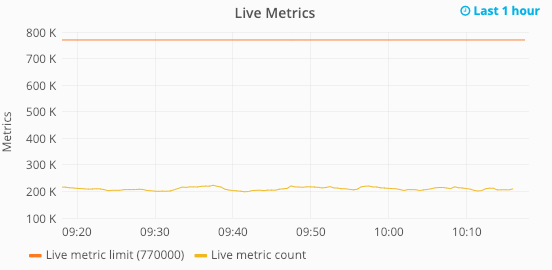

Account Diagnostics
======================

.. index:: Traffic Graphs, Account limit, metric limit, datapoint limit, datapoints per second

.. contents::

We provide a useful summary of your account activity on your account profile page in the Incoming Traffic graph. You can navigate to this by selecting the "Account Diagnostics" submenu from the "Metrics" tab.

.. Link to HG traffic dashboard will appear here if the user is logged in.

   
Activity by Protocol
--------------------

This card provides a quick overview of your recent traffic. The icon in the status column provides information on your last received data. The green icon indicates that we have seen data arrive recently on that interface. The yellow and red icons show that no data has arrived on that interface for at least 5 and 15 minutes respectively. The blue icon indicates that we have never seen any traffic on that interface.

Live Metrics Graph
------------------

In the graph above, the **orange line** is the *live metric limit* - the number of metrics you can update in a rolling 5-minute period. One metric name might look something like 'my.server.cpu.load'. In this example it is set at 10,000, allowing 10,000 metric names to be sent at the same time.

The **yellow line** is *the number of live metrics incoming for the account*, on this graph it fluctuates between around 5,000 and 6,000 live metrics. When we see more than the limit sent at the same time, some metrics will be dropped. **Note:** Live metrics are sometimes also called concurrent metrics in your traffic dashboard.

Datapoint Rates Graph
------------------------

In the graph above, the **green line** is *the number of data points allowed per second, or the datapoint rate limit*. In this example it is set at 400,000, allowing the user to send 400,000 data points a second.

The **orange line** is the total number of datapoints per second received associated with the account.

Metrics Created and Deleted Graph
---------------------------------

   
The above graph can give you visual insights into recent metrics being created and deleted. This can be useful for tracking spikes in traffic, and monitoring any configured expiry rules.

Why are there Account Limits?
-----------------------------

TL;DR - As a prevention measure against accidents and malice.

It's possible for a user to run a script which accidentally (or deliberately) updates millions of metrics a second. Sensible limits on what data we process ensures that one customer cannot affect the quality of service for others. Check out this `article <https://www.hostedgraphite.com/blog/per-metric-rate-limiting-how-we-protect-our-backend>`_ for more details on why these limits are put in place.

Generally, we want customers to be able to send data at a high rate and we can monitor and increase any limits as necessary.

.. raw:: html

    
