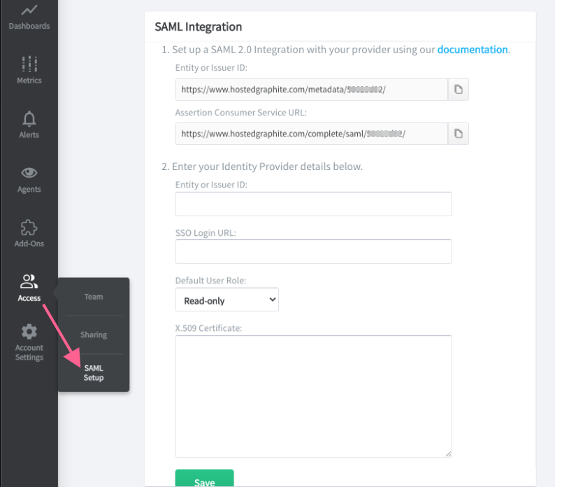

SAML Authentication
===================

.. index:: SAML Authentication

.. contents::

Hosted Graphite supports Single Sign On (SSO) via SAML-enabled identity providers. This allows users to login to our service using their existing organization credentials. A SAML integration is set up on the team's primary Hosted Graphite account, and any subsequent user signups via SAML will be added to this account as team members.

**Note:** SAML integration is included for all plans but must be enabled upon request. Please reach out to `support <mailto:support@hostedgraphite.com>`_ and we will set this up for you! Once enabled, you can locate the SAML Setup page from the Access menu.

SAML Setup
----------
Identity providers require SAML account metadata from Hosted Graphite in order to set up a SAML integration. 

- | Entity ID URL: ``https://CLUSTER.hostedgraphite.com/metadata/YOUR-USER-ID/``
- | Assertion Consumer URL: ``https://CLUSTER.hostedgraphite.com/complete/saml/YOUR-USER-ID/``
- | Connection Type: IdP Initiated via *IdP portal* or SP Initiated via ``/login/saml/YOUR-USER-ID/``
- | XML Metadata: Available by accessing the *Entity ID URL* above while logged in.
- | NameID Format: Email address.
- | SAML Version: 2.0

.. |login-link| replace:: ``/login/saml/YOUR-USER-ID/``
.. _login-link: /login/saml/YOUR-USER-ID/

   
Hosted Graphite can integrate with providers that support the SAML 2.0 specification. Example steps for connecting with some supported identity providers are listed below. 

Azure Active Directory
----------------------

**Create a Hosted Graphite integration with Azure AD**

1. Login to the Azure AD portal, select your directory, then go to **Applications** and **Add**.
2. Click **Add an application from the gallery** then search for and select *Hosted Graphite*.
3. Open the Hosted Graphite application integration page, click **Configure single sign-on** and then select **Azure AD Single Sign-On**.
4. Enter Identifier ``https://CLUSTER.hostedgraphite.com/metadata/YOUR-USER-ID/``
5. Enter Reply URL ``https://CLUSTER.hostedgraphite.com/complete/saml/YOUR-USER-ID/``
6. The final configuration screen shows the values required for the next step. Download your certificate from this page.

**Adding Azure AD provider details to Hosted Graphite**

1. Navigate to the SAML Setup page to enter details from the configuration screen of the Azure AD App.

   * In the Entity ID field, enter your *Issuer URL*.
   * In the SSO Login URL field, enter your *SAML SSO URL*.
   * In the Certificate text box, enter the contents of the certificate file you downloaded.
2. Select a default user role for new team members.
3. Click **Save**.

This information is also available in the `Azure documentation <https://azure.microsoft.com/en-us/documentation/articles/active-directory-saas-hostedgraphite-tutorial/>`_.

.. index:: Azure AD SAML Setup

Okta
----

**Create a Hosted Graphite integration with Okta**

1. Login to the Okta portal, go to **Admin** and then **Applications** and click **Add Application**.
2. Search for *Hosted Graphite* and select the SAML enabled app.
3. In **General Settings**, enter your HG User ID. This can be found on the SAML Setup page.
4. Click **Next**.
5. Assign the application to people on your team, and click **Next**.
6. Confirm any additional information for each user and click **Done** when finished.
7. Go to the **Sign On** tab and select **View Setup Instructions** to show the information required in the next step.

**Adding Okta provider details to Hosted Graphite**

1. Navigate to the SAML Setup page.
2. Enter the details from **Setup Instructions** part of the HG Okta App.
3. Select a default user role for new team members.
4. Click **Save**.

This information is also available in the `Okta documentation <http://saml-doc.okta.com/SAML_Docs/Configure-SAML-2.0-for-Hosted-Graphite.html>`_.

.. index:: Okta SAML Setup

OneLogin
--------

**Create a Hosted Graphite integration with OneLogin**

1. Login to the OneLogin portal, go to **Apps** and then **Add Apps**.
2. Search for *Hosted Graphite* and select the SAML enabled app.
3. Click **Save** to add the app to your Company Apps and display additional configuration tabs.
4. In the **Configuration** tab, enter your HG User ID. This can be found on the SAML Setup page.
5. Click **Save**.
6. Go to the **SSO** tab to view the values that you'll copy into your Hosted Graphite account.

**Adding OneLogin provider details to Hosted Graphite**

1. Go to the SAML Setup page to enter the details from the **SSO** section of your OneLogin App.

   * In the Entity ID field, enter your *SAML Issuer URL*.
   * In the SSO Login URL field, enter your *SAML Endpoint HTTP URL*.
   * In the Certificate text box, enter your *X.509 Certificate*.
2. Select a default user role for new team members.
3. Click **Save**.

.. index:: OneLogin SAML Setup

Ping Identity
-------------

**Create a Hosted Graphite integration with Ping Identity**

1. Login to the PingOne portal, go to **Applications**, click **Add Application** then **Search Application Catalog**.
2. Search for *Hosted Graphite* and select the SAML app and click **Setup**.
3. Download the Certificate to enter into Hosted Graphite later, and click **Continue to Next Step**.
4. Enter ACS URL ``https://CLUSTER.hostedgraphite.com/complete/saml/YOUR-USER-ID/``
5. Enter Entity ID ``https://CLUSTER.hostedgraphite.com/metadata/YOUR-USER-ID/``
6. Select **Continue to Next Step** twice and then **Save and Publish**.

**Adding Ping Identity provider details to Hosted Graphite**

1. In PingOne, go to **Applications** and select the app you just created.
2. In the Configuration section, **Issuer** is your Entity ID.
3. Your IDP ID used below is the last parameter of the **Initiate Single Sign-on URL**.
4. In ``https://sso.connect.pingidentity.com/sso/idp/SSO.saml2?idpid=${idpid}`` replace ${idpid} with your IDP ID. This is your SSO Login URL.
5. Open the certificate file downloaded earlier with a text editor. This is your Certificate.
6. Go to the SAML Setup page and enter your Entity ID, SSO Login URL and Certificate.
7. Select a default user role for new team members.
8. Click **Save**.

.. index:: Ping Identity SAML Setup

Salesforce
----------

**Create a Hosted Graphite integration with Salesforce**

1. Login to Salesforce, go to Settings and search for "Identity Provider".
2. Set Identity Provider to enabled, and go to **Connected Apps**.
3. Create a new connected app, enter a Name and Email.
4. Enter Entity ID ``https://wwCLUSTERw.hostedgraphite.com/metadata/YOUR-USER-ID/``
5. Enter ACS URL ``https://CLUSTER.hostedgraphite.com/complete/saml/YOUR-USER-ID/``
6. Set NameID format to ``emailAddress``.
7. Click **Save**.

**Adding Salesforce provider details to Hosted Graphite**

1. In Salesforce, go to **Manage Connected Apps** from Settings and open the app you just created.
2. Under SAML Service Provider Settings, *Issuer* is your Entity ID.
3. Under SAML Login Information, *SP-Initiated Redirect Endpoint* is your SSO Login URL.
4. Under SAML Service Provider Settings, click the name of your certificate and then *Download Certificate*.
5. Go to our SAML Setup page and enter your Entity ID, SSO Login URL and Certificate.
6. Select a default user role for new team members.
7. Click **Save**.

.. index:: Salesforce SAML Setup

Auth0
-----

**Create a Hosted Graphite integration with Auth0**

1. Login to Auth0, select Add New Application and Single Page Web App.
2. Go to Addons and select SAML2 Web App.
3. Enter Application Callback URL ``https://CLUSTER.hostedgraphite.com/complete/saml/YOUR-USER-ID/``
4. Replace the Settings JSON field with the content below:

.. code-block:: javascript

  {
    "audience": "https://CLUSTER.hostedgraphite.com/metadata/YOUR-USER-ID/",
    "nameIdentifierFormat": "urn:oasis:names:tc:SAML:1.1:nameid-format:emailAddress",
    "nameIdentifierProbes": [
      "http://schemas.xmlsoap.org/ws/2005/05/identity/claims/emailaddress"
    ]
  }

5. Click **Save**.

**Adding Auth0 provider details to Hosted Graphite**

1. Go to Addons section of the new Auth0 App and select **SAML2 Web App**.
2. Under the Usage tab, *Issuer* is your Entity ID.
3. *Identity Provider Login URL* is your SSO Login URL.
4. *Identity Provider Certificate* is your Certificate.
5. Go to the SAML Setup page and enter your Entity ID, SSO Login URL and Certificate.
6. Select a default user role for new team members.
7. Click **Save**.

**Notes**

1. The team's primary Hosted Graphite account will continue to log in without SAML. This cannot currently be changed.
2. Existing users cannot be signed in via SAML. Please get `in touch with support <mailto:support@hostedgraphite.com>`_ if you would like that changed.
3. New users **must** signup via the single-sign-on url provided by the 3rd party provider, and not via the Hosted Graphite user interface. This is especially important for Azure SAML login.

.. index:: Auth0 SAML Setup

.. raw:: html

    
