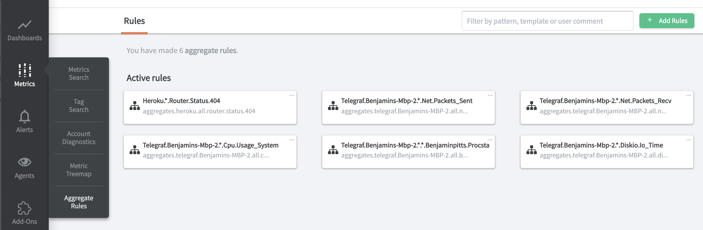
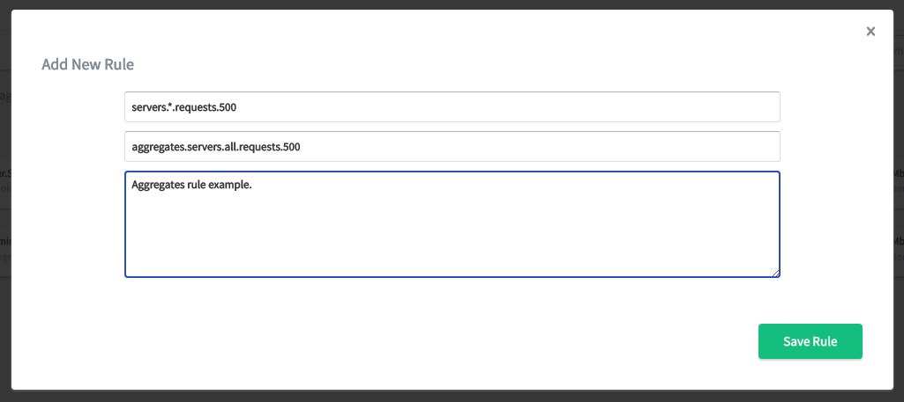
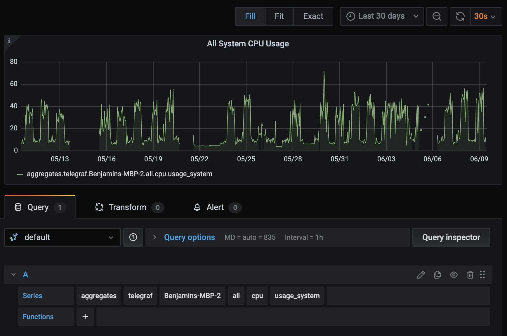

Aggregation Rules
=================

.. index:: Aggregation Rules

.. contents::

What are aggregation rules?
---------------------------

Aggregation rules offer the ability to automatically combine datapoints from multiple input metrics into a smaller set of output metrics according to defined rules. This is useful if you need to use hundreds or thousands of input metrics in a dashboard or graph query, but still want a fast answer. Aggregation rules allow you to effectively pre-compute the most expensive parts of some queries.

Aggregation rules perform the same job as the `carbon_aggregator <http://graphite.readthedocs.io/en/latest/config-carbon.html?highlight=aggregate#aggregation-rules-conf>`_ service if you're self-hosting the open source Graphite tools.

Hosted Graphite's additional :doc:`data views </additional/data-views>` feature is also supported on top of the output metrics from an aggregation rule, so you can get the :sum or an arbitrary percentile across all the metrics matching an aggregation rule.

**NOTE**: The output metric names will be automatically prefixed with "aggregates." even if you do not specify it in the "output" field.

**Why are aggregates useful?**

If you have a render query using a wildcard to match a large number of metrics, the result of the render query can, in some cases, be very slow to return. Using aggregations reduces the number of metrics which need to be retrieved and can reduce the time spent rendering graphs.

Examples
--------

If you have a number of metrics which match the pattern ``servers.*.requests.<response_code>``, and you want to render ``servers.*.requests.200``, the overhead in matching all nodes which match the ``*`` in the second node, can be skipped if you set up an aggregation rule with the following pattern/output combination:

.. code-block:: bash

 {
    "pattern": "servers.*.requests.<response_code>",
    "output": "aggregates.servers.all.requests.<response_code>"
 }

The effect of this config would be as follows:
Datapoints coming in for metrics named like this:

.. code-block:: bash

 servers.server1.requests.200
 servers.server2.requests.200

Would be copied and combined as soon as the datapoints are received and a new metric created:

- ``aggregates.servers.all.requests.200``

Datapoints coming in for metrics named like:

.. code-block:: bash

 servers.server1.requests.404
 servers.server2.requests.404

Would be copied and combined as soon as the datapoints are received and a new metric created:

- ``aggregates.server.all.requests.404``

Now, instead of defining a graph requesting ``servers.*.requests.200`` which could be slow if it matches hundreds or thousands of metrics, you can define a graph requesting ``aggregates.servers.all.requests.200``. That means you'll be querying just one metric, which will be much faster.

You can also use the ``<<rest>>`` pattern as described in the carbon-aggregator docs which allows you to match across nodes. For example the pattern/output config might look like:

.. code-block:: bash

 {
   "pattern": "servers.*.<<rest>>",
   "output": "aggregates.servers.all.<rest>"
 }

This would combine all metrics seen with a starting ``servers.*`` into the same metric under ``aggregates.servers.all.<rest>``.

So if we saw some metrics which looked like:

.. code-block:: bash

 servers.server1.requests.200
 servers.server2.requests.200
 servers.server3.requests.200
 servers.server4.requests.200

They would be combined into a new metric:

- ``aggregates.servers.all.requests.200``

Similarly, the following:

.. code-block:: bash

 servers.server1.auth.v2.success
 servers.server2.auth.v2.success
 servers.server3.auth.v2.success
 servers.server4.auth.v2.success

Would be matched by the same pattern and would combine into the new metric:

- ``servers.all.auth.v2.success``

Manage Aggregation Rules
------------------------

Aggregation rules can be conveniently created, updated, and deleted through through the Hosted Graphite UI. Your rules will be listed in the "Aggregate Rules" section of the Hosted Graphite application:

Create a new rule:

   
Once a new rule is made, a single metric prefixed with ``aggregates.`` will be created and appear in your metrics list. You can now use this metric in your primary dashboards to visualize the aggregated values of multiple metrics:

       
