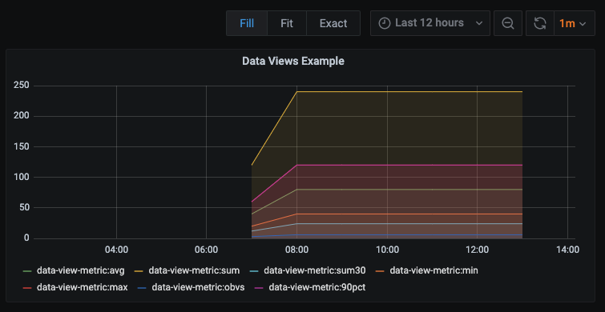

.. _data-views-reference:

Data Views
==========

.. contents::

Hosted Graphite automatically generates different statistical views on the data you send, providing fast views on your metrics at the most appropriate resolution for viewing on your dashboard. The different views we keep by default for all our graphite metrics are:

- | **:avg**
  | (default view) Average of datapoints received during the timeframe of the current graph resolution.

- | **:sum**
  | Sum of datapoints received during the timeframe of the current graph resolution. This changes depending on the zoom level.
  | Example: using :sum on a graph with datapoints drawn every 30 seconds will show the sum of all datapoints received in each 30 second period.

- | **:sumrate**
  | The sum divided by the number of seconds between datapoints, giving you a per second rate.
  | :sum and :sumrate are the most common views to use with Counter metrics.

- | **:sum30** **:sum60** **:sumN**
  | Provides the sum received over a given number of seconds, calculated from the :sumrate. E.g. ":sum30" provides the sum over 30 seconds.
  | This is useful when you want a sum of a metric that is consistent regardless of what data resolution you are viewing.
  | When drawing a graph at a wider timescale there are more datapoints than available space to draw them. Using the ":sumN" syntax lets you see an accurate scaled sum over a given number of seconds.

- | **:min**
  | Minimum value

- | **:max**
  | Maximum value

- | **:obvsrate**
  | The observations divided by the number of seconds in the collection period, giving you a per second rate.

- | **:90pct** **:95pct**  **:99pct** **etc...**
  | Want arbitrary percentile data? Just add the number after the colon followed by 'pct'. It accepts values from 01 to 99. If you want 100th percentile you should be using ":max"!

Example Usage
-------------

Append a view to the end of your metric to visualize your data in different ways. 
A simple example of this would be ``data-view-metric:sum`` or ``test.testing:obvs``.

   Example of all Data Views

Comparison to StatsD
--------------------

The Hosted Graphite views aren't perfectly analogous to statsd, but for general use it accomplishes similar results.

- | **counters** -> ':sum' or ':obvs'
- | **gauges** -> ':sumrate' or ':obvsrate'
- | **timers** -> ':avg' or ':min' or ':max'

Data Views and Graphite Functions
--------------------------------- 

`Graphite Functions <https://graphite.readthedocs.io/en/latest/functions.html>`_ act on one or more data series, transforming them into a new data series. When using a graphite function it is important to note that:

- | The data view specified in the query is not changed depending on the function. If you use the `sumSeries() <http://graphite.readthedocs.io/en/latest/functions.html#graphite.render.functions.sumSeries>`_ function, you will be summing the average values of each series unless you also use **:sum** in your query as well.
- | The graph's resolution can be changed by functions, but the resolution of the data series cannot. For example, `summarize() <http://graphite.readthedocs.io/en/latest/functions.html#graphite.render.functions.summarize>`_ allows you to group all the datapoints in a specified timeframe into one. Changing the zoom level of the graph won't change the interval output by the summarize() function, but it may change the number of data points available to be summarized.
