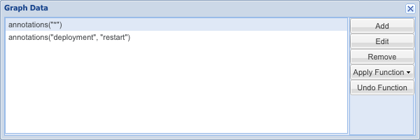
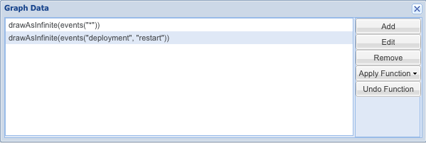
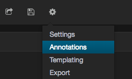
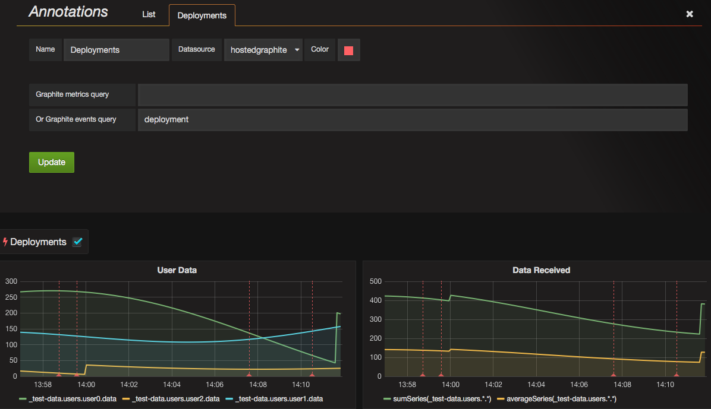
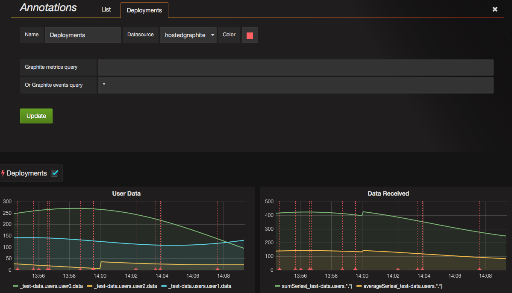

Annotations and Events
======================

Hosted Graphite now supports Annotations and Graphite Events.
The Annotations feature is designed as a simpler interface to create events with
tags.

.. contents::

What is an annotation?
----------------------

An annotation relates your metrics to intermittent events for example when you deploy code, run some tests (hopefully successfully), or a long-running job completes.

Creating an annotation (for the impatient)
^^^^^^^^^^^^^^^^^^^^^^^^^^^^^^^^^^^^^^^^^^

This snippet of code will create an annotation  with the tags "deployment" and "feature", titled "New Super-duper Feature". It'll be timestamped at the time the event is received.

::

   curl -X POST https://YOUR-API-KEY@api.hostedgraphite.com/api/v1/annotations/events/ -d \
   "&title=New Super-duper Feature\
   &tag=deployment\
   &tag=feature"

More details about the Annotations API
--------------------------------------

Annotations
^^^^^^^^^^^

Annotations have the following properties:

* **title** - (required) A short summary of the annotation.

::

    super-duper feature updated to v0.0.12

* **description** - A more in-depth description of the annotation.

::

    Slow rollout of new super-duper feature: 9b562b2. Relies on old version: 4ec124b4.
    Enables the new super-duper feature in production.

* **tags** - A single word or multiple short strings (all case-insensitive) to organize different types of events. *e.g.* 'deployments', 'feature', 'test' etc.
* **start_time** - Unix timestamp describing when the event occurred. If this is not specified, the time of event creation is used.
* **end_time** - Optional timestamp describing when the event completed. **Note:** We currently don't support `region events <http://docs.grafana.org/reference/annotations/#adding-regions-events>`_. As a result, *end_time* has no actual use in annotations.

There's no restriction on having annotations with the same time stamps, but the combination of start time and title must be unique.

Authentication
^^^^^^^^^^^^^^

The API uses basic HTTP authorization. An example using curl:

::

    curl -X POST https://YOUR-API-KEY@api.hostedgraphite.com/api/v1/annotations/events/

or

::

    curl -u 'YOUR-API-KEY:' -X POST https://api.hostedgraphite.com/api/v1/annotations/events/

Delete a single event
^^^^^^^^^^^^^^^^^^^^^
Deleting an annotation via the API is as simple as this:

::

    curl -X DELETE https://YOUR-API-KEY@api.hostedgraphite.com/api/v1/annotations/events/ \
         -d '{"title": "New Super-duper Feature", "timestamp": 1431607046}'

Graphite Events
^^^^^^^^^^^^^^^

Events as per the Graphite project are fully supported. Insertion and rendering of Graphite Events works the same as the annotations endpoint, though the Graphite events API takes a JSON formatted data structure.

Create a single event
^^^^^^^^^^^^^^^^^^^^^

::

    curl -X POST https://YOUR-API-KEY@api.hostedgraphite.com/api/v1/graphite/events/ \
         -d '{"what": "New Super-duper Feature", "when":1431607046, "tags":"deployment feature"}

Graphite Composer
-----------------

Annotations
^^^^^^^^^^^

To support the display of Annotations, there is a function **annotations()** available in graphite to query and display the events.
There are two options:

::

        annotations("*")

This first option with a wildcard queries all available annotations for the time period selected

::

        annotations("restart", "deployment")

This version queries all annotations with the tags "restart" and "deployment" for the time period selected

Events
^^^^^^

The graphite events function **events()** is also available:

::

        drawAsInfinite(events("*")
        drawAsInfinite(events("restart", "deployment")

Dashboard Annotations
---------------------

The dashboard annotations feature works exactly as specified in the `annotation documentation <https://grafana.com/docs/grafana/latest/dashboards/annotations/>`_. It can be used to query by tags (not graphite targets).

* To open the annotations panel, click the settings icon in the top bar and select `Annotations`.

* Set the datasource to 'hostedgraphite' and use the 'Graphite event tags' input box to filter by tags.

* Individual wildcards also work to display all events.

.. _grafana documentation: http://docs.grafana.org/reference/annotations/

.. raw:: html

    
