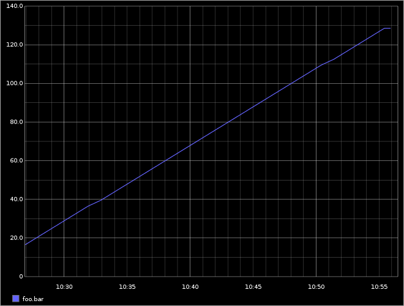
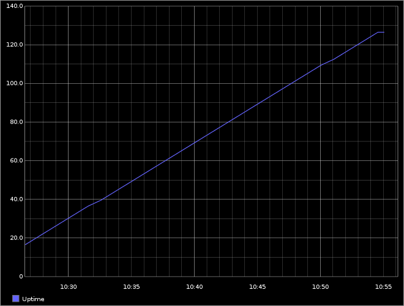
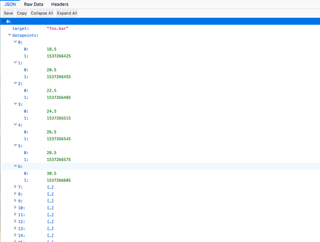
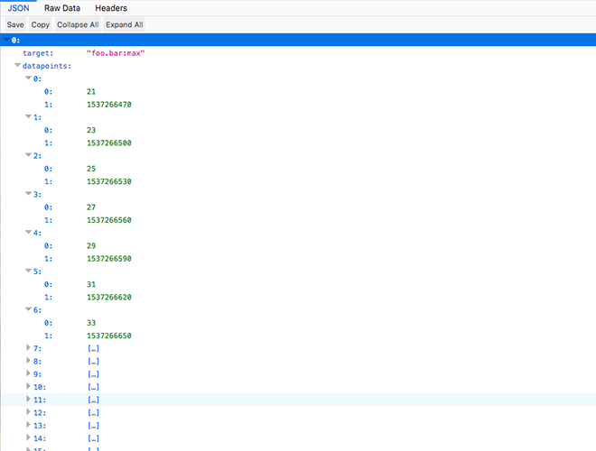

===================
Graphite Render API
===================

.. contents::

The Graphite Render API is a powerful way to query your metric data saved in Hosted Graphite. With the Graphite Render API you can:

- | View raw metric data outside of your primary dashboard.
- | Apply functions to your metric data.
- | Search for data within a specific or relative time frame.
- | Retrieve the data in different display formats.
- | Use Access Keys to integrate metric data into external tools or services.

Render Endpoint
---------------

Used to make render queries that can be easily integrated into external or self-built tools.

To integrate Hosted Graphite data externally, :ref:`create-ak-reference` to authorize render requests. Copy the key URL and add ``/render?target=``

For example:

::

  https://www.hostedgraphite.com/YOUR-UID/<Access_Key>/graphite/render?target=

The render endpoint when signed-in to your account is:

::

  https://www.hostedgraphite.com/YOUR-UID/graphite/render?target=

Making Queries
--------------

- | **Target**

This parameter specifies the path to identify one or more metrics and also supports wildcards (*).

Note: The default :ref:`data-views-reference` applied to the query is "avg" which might not always be useful depending on the type of metric. Change this by appending the desired data view to the metric name separated by a colon (:). Refer to the :ref:`render-example` below.

- | **From / Until**

These parameters are optional and accept relative or absolute times (or a combination of both). Relative Time is the length of time from the current time and is always peceded with a minus sign (-). If no time parameters are specified, the default values are ``from=now-24h`` and ``to=now``. 

The accepted units of time are:

.. list-table::
   :widths: 60 60
   :header-rows: 1

   * - Abbreviation
     - Unit
   * - s
     - Seconds
   * - min
     - Minutes
   * - h
     - Hours
   * - d
     - Days
   * - w
     - Weeks
   * - mon
     - Month (30 Days)
   * - y
     - Year (365 Days)

For Example:
::

  https://www.hostedgraphite.com/YOUR-UID/graphite/render?target=foo.bar.*&from=now-1w

Display Formats
---------------
If unspecified, the default format is png. Using the ``&format=`` argument you can decide how you want to view your data:

- | **&format=png**: Renders a graph as a 330×250 px png.
- | **&format=svg** : Renders a graph as a 330×250 px svg.
- | **&format=raw**: Line-delimited output. (target, start timestamp, end timestamp, step, data)
- | **&format=csv**: Creates a CSV file to download (metric,date/time,value)
- | **&format=json**: Returns a JSON object.

.. _render-example:

Examples
--------

Using sample metric foo.bar, below are some example queries and outputs (click the images to enlarge):

::

  https://www.hostedgraphite.com/YOUR-UID/ACCESS-KEY/graphite/render?target=foo.bar&from=now-30min

   Default render

::

  https://www.hostedgraphite.com/YOUR-UID/ACCESS-KEY/graphite/render?target=alias(foo.bar,"Uptime")&from=now-30min

   Render with aliased metric name

::

  https://www.hostedgraphite.com/YOUR-UID/ACCESS-KEY/graphite/render?target=foo.bar&from=now-30min&format=json

   Default JSON

::

  https://www.hostedgraphite.com/YOUR-UID/ACCESS-KEY/graphite/render?target=foo.bar:max&from=now-30min&format=json

   JSON with "max" data view

Curl Example:

.. code-block:: bash
  
  curl -X GET "https://www.hostedgraphite.com/YOUR-UID/ACCESS-KEY/graphite/render?target=foo.bar:max&from=now-30min&format=json"

For more information about building queries and customizing outputs, visit the `Graphite Render Docs <https://graphite.readthedocs.io/en/latest/render_api.html>`_.

.. raw:: html

    