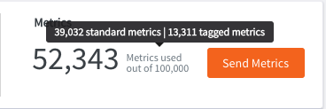

==============
Tag API
==============

.. contents::

Listing All Tags
----------------

**End Point:**
::

  GET /api/v1/tags  

**Curl examples:**
::

   curl -X GET "https://YOUR-API-KEY-HERE@api.hostedgraphite.com/api/v1/tags"

Search for all the tag lists

**Response format**:

.. code-block:: javascript

 HTTP/1.1 200
 Content-Type: application/json

 ["cluster", "host", "process", "service", "name"]

**Status Codes:**

- **200** - Success

.. _search-tags:

Search Tagged Metrics
---------------------

**End Point:**
::

  GET /api/v1/tags/findSeries?
  GET /api/v1/tags/<tagname>?

**Curl examples:**
::

    curl -X GET "https://YOUR-API-KEY-HERE@api.hostedgraphite.com/api/v1/tags/findSeries?expr=cluster=prod"
    curl -X GET "https://YOUR-API-KEY-HERE@api.hostedgraphite.com/api/v1/tags/findSeries?expr=cluster=prod&host=egg-0001"

Search for tagged metric/series that match the expression ``cluster=prod``

::

    curl -X GET "https://YOUR-API-KEY-HERE@api.hostedgraphite.com/api/v1/tags/host?filter=prod-00*&limit=3"

Search for tagname ``host`` that match  the value ``prod`` and only show 3 matching results. 

**Available Parameters:**

- | **expr**
  | Format: expr=tagname=tagvalue or expr=tagname1=tagvalue1&tagname2=tagvalue2
  | To search for the tagged series that match the expression, users should include both tagname and value in the query.
- | **filter**
  | Format: filter=prod-00*
  | Tag value to search for.
- | **limit**
  | Format: limit=3
  | To limit the amount of search results to the given number.

**Response format with '?expr=cluster=prod'**:

.. code-block:: javascript

  HTTP/1.1 200
  Content-Type: application/json

  ["0.queue_backlog;cluster=prod;host=prod-egg-0021;process=grind;service=data_process", "2.queue_backlog;cluster=prod;host=prod-egg-0021;process=grind;service=data_process", "0.items;cluster=prod;host=prod-egg-001;process=dump;service=data_process"]

**Response format with '?filter=machine-000*&limit=3'**:

.. code-block:: javascript

  HTTP/1.1 200
  Content-Type: application/json

  {"tag": "host", 
   "values": [{"count": 59, "value": "machine-0001"},
              {"count": 57, "value": "machine-0002"},
              {"count": 59, "value": "machine-0003"}]
  }

**Response Parameters**:

- | **tag**
  | Tag name.
- | **values**
  | Tag value.

**Status Codes:**

- **200** - Success
- **400** - Invalid format
- **501** - Not implemented 

Deleting Tagged Metrics
-----------------------

**End Point:**
::

  POST /api/v1/tags/delSeries

**Curl example:**
::

  curl -X POST "https://YOUR-API-KEY-HERE@api.hostedgraphite.com/api/v1/tags/delSeries" --data-urlencode "path=foo.bar;tag1=val1;tag2=val2"

Delete all seires that match the path `foo.bar` and `tag1=val1` and `tag2=val2`.

**Status Codes:**

 - **200** - Success
 - **400** - Invalid request.

.. raw:: html

    

Monitoring your Tagged Metrics usage
------------------------------------

If you have sent tagged metrics then the number of tagged metrics you have sent will be displayed when you hover over the metric count on your `Homepage <https://www.hostedgraphite.com/app/>`_:

