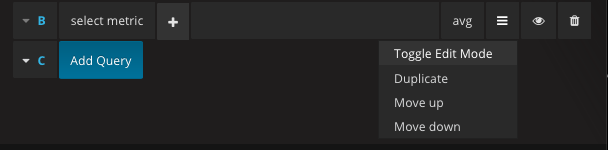
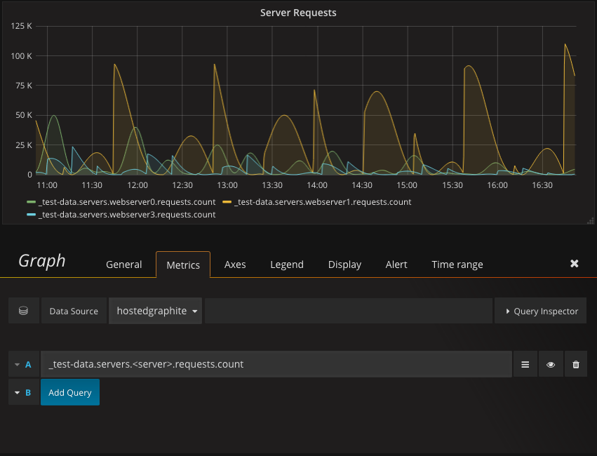

====================
Render Variables API
====================

.. contents::

Render Variables provide versatility when constructing metric queries. Instead of hard-coding full metric names, use variables as placeholders to dynamically build your queries. This is similar, but not the same as the primary dashboard's built-in template variables.

Note: render variables are currently not compatible with alerting, we advise against using them in alert queries.

Creating a variable
-------------------

``POST /v1/variables/<var-name>/``

Replace <var-name> with the name you want to give the variable. Place your variable values in a JSON file and include it in the POST request. A variable name is required however the values can be empty.

**Example variable values:**

.. code-block:: javascript

  {
    "values": [
      "foobar",
      "foo",
      "bar",
      "baz"
    ]
  }

**Curl example:**
::

  curl -X POST "https://<apikey>@api.hostedgraphite.com/v1/variables/<var-name>/" -d @values.json

**Response:**

.. code-block:: javascript

 {
  "url": "/v1/variables/<var-name>/"
 }

- **201**: Created
- **400**: Invalid request (JSON could be incorrectly formatted or the variable name already exists)

Updating a variable
-------------------

``PUT /v1/variables/<var-name>/``

Overwrites the values for an existing variable

**Curl example:**
::

  curl -X PUT "https://<apikey>@api.hostedgraphite.com/v1/variables/<var-name>/" -d @values.json

**Response:**

.. code-block:: javascript

 {
  "url": "/v1/variables/<var-name>/"
 }

- **200**: Updated
- **400**: Invalid request (JSON could be incorrectly formatted)
- **404**: Variable not found

Search variables
----------------

``GET /v1/variables/?query=``

**Curl example:**
::

  curl -X GET "https://<apikey>@api.hostedgraphite.com/v1/variables/?query="

A "contains" query that  will return a JSON object with the name and path of variables that contain the search term. To list all variables, leave the query empty.

**Response:**

.. code-block:: javascript

  {
    "variables" : [
      {
        "name" : "foo",
        "url" : "/v1/variables/foo/"
      },
      {
        "name" : "bar",
        "url" : "/v1/variables/bar/"
      }
    ]
  }

- **200**: Success

If you have no variables or there are no variables that match your query you will be returned with an empty object:

.. code-block:: javascript

  {
    "variables": []
  }

Get variable values
-------------------

``GET /v1/variables/<var-name>/``

Returns a JSON object with the values assigned to <var-name>

**Curl example:**
::

  curl -X GET "https://<apikey>@api.hostedgraphite.com/v1/variables/<var-name>/"

**Response:**

.. code-block:: javascript

  {
    "values": [
      "foobar",
      "foo",
      "bar",
      "baz"
    ]
  }

- **200**: Success
- **404**: Variable does not exist

Delete a variable
-----------------

``DELETE /v1/variables/<var-name>/``

**Example:**
::

  curl -X DELETE "https://<apikey>@api.hostedgraphite.com/v1/variables/<var-name>/"

**Response:**

- **200**: Success
- **404**: Variable not found

Graphing with render variables
------------------------------

This cannot be done with the simple query builder, you must toggle the edit mode to the free-text mode.

Refer to a render variable by including the variable name enclosed in angled brackets in your metric query.

Using dashboard templates within render variables
-------------------------------------------------

You can place template variables within render variables by surrounding them with curly brackets.

**Example:**
::

  $foo.<{$foo}_metric>.bar 
