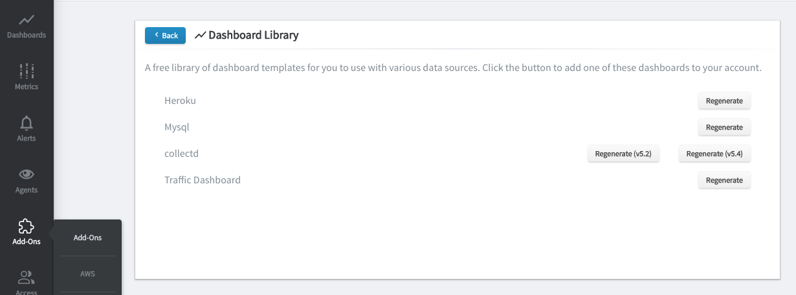

Dashboard Library
=================

.. index:: Dashboard, install, templates

We supply several open source templates for you so you don't have to start from scratch for various services. This collection is only beginning and you can contact us if you feel we are missing something important or have a template to give us.

The **HG Traffic Dashboard** is included with every new account. This dashboard uses _hg_meta metrics, which are used for tracing traffic and are provided by us at no extra charge. 

To generate a dashboard from one of our templates, go to the `add-ons <https://www.hostedgraphite.com/app/addons/>`_ page, click on the dashboard library card and choose one of the listed options.

- | **Heroku**

- | **Mysql**

- | **Collectd**

- | **Traffic Dashboard**

For AWS, an automatic dashboard will be created for any service that you select during your AWS => HG configuration. We include automatic dashboards for CloudFront, DynamoDB, EBS, EC2, Elasticache, ELB, RDS, Redshift, Route53, and SQS.

