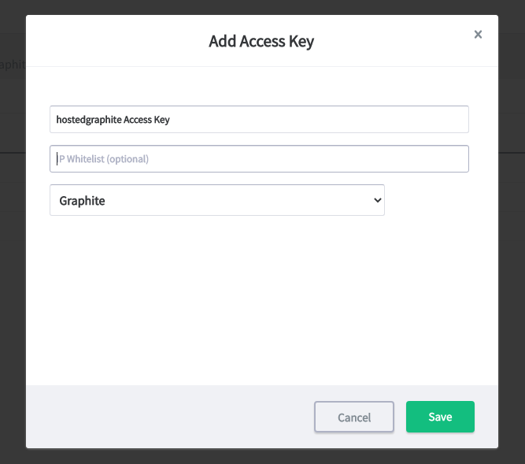
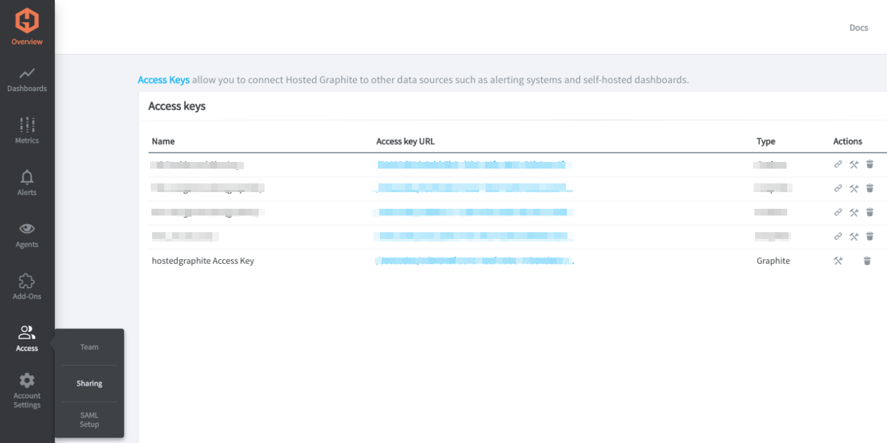
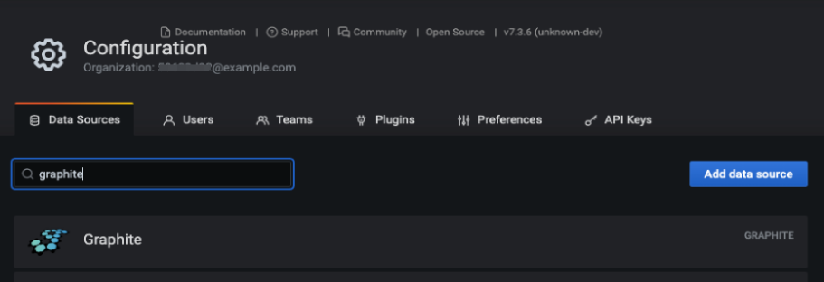
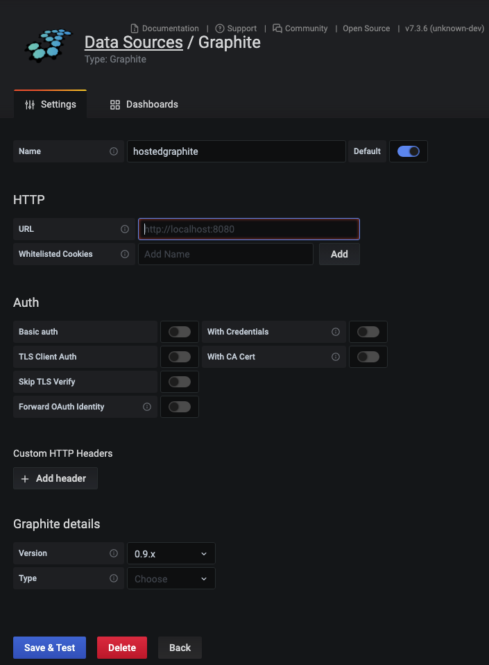
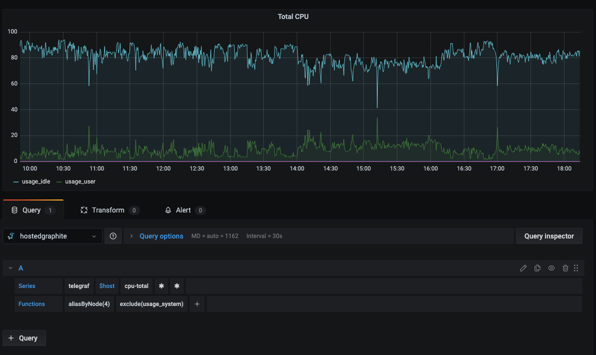

Local Dashboard Integration
===========================

.. index:: Dashboards

Dashboards come standard with all Hosted Graphite plans which is accessible through the Hosted Graphite app. 

If you have a local installation of dashboards and wish to use Hosted Graphite as a data source, here’s how:

Allow permission to access your Hosted Graphite data with an Access Key
-----------------------------------------------------------------------

In the Hosted Graphite App menu, click on ``Access`` and select ``Access Keys``. Click on ``Add Access Key`` in the upper right-hand corner. Give your Access Key a name and select ``Graphite`` (this will give the external application access to the Graphite data).

   Add a New Access Key Form

   Access keys list

Copy the Access Key URL and read more details about Access Keys :doc:`here </accountmanagement/access-keys>`.

Adding the Hosted Graphite Data Source to Your Local Dashboard Instance
-----------------------------------------------------------------------

   Data Source Management Page

In the Primary Dashboard menu go to ``Data Sources``, then in the Data Sources page click on ``Add Data Source``.

   Add Data Source Form

Give your Data Source a name (type is Graphite). Paste the Access Key in the URL box. Then click ``Save & Test``.

*Note: Checking the default box will make the Hosted Graphite data source the primary data source when entering metric queries.*

More information about Graphite Data Sources are documented `here <http://docs.grafana.org/features/datasources/graphite/>`_.

Create a new Dashboard or Panel to start rendering your Hosted Graphite Metrics
--------------------------------------------------------------------------------

Select your new Hosted Graphite data source and enter a metric query.
