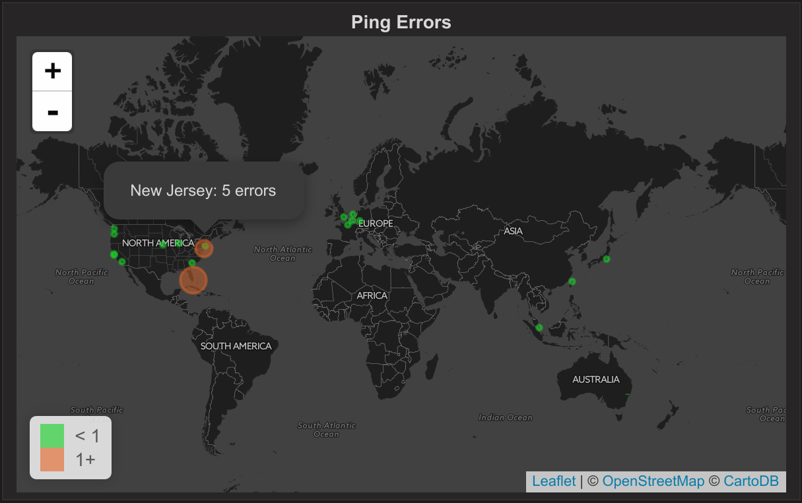
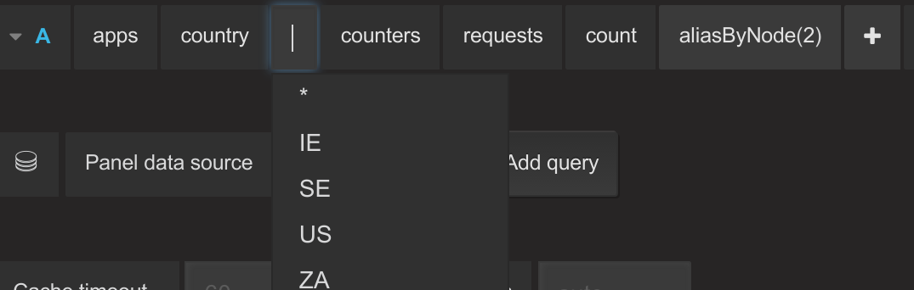

Worldmap Panel
==============

.. index:: Worldmap Panel

.. Link to grafana tour will appear here if the user is logged in.

The Worldmap Panel is a tile map of the world that can be overlaid with circles representing data points from a query. 

Data points are linked to locations on the map by matching part of the metric name to a key in the set of 'Location Data'.

Included location data:

- Countries (2 letter codes)
- Countries (3 letter codes)
- US states
- Probes (a :ref:`selection of cities <probes-list>`)

This works by matching country codes (like US or GB or FR) or US state codes (TX or NY) to a node or a wildcard in a metric namespace. If there is a match in the list of countries or states then a circle will be drawn at the location.

The size of the circle depends on the value of the matched metric. Circle size is relative e.g. if you have 3 countries with values 1, 2 and 3 or 100, 200 and 300 then you will get one small circle, one medium circle and one large circle.

Query Example
-------------

Use the **aliasByNode** function to point to the field containing the country code. See the image below for an example of a graphite query.

Map Visual Option Settings
--------------------------

:Center:
  This settings configures the default center of the map. There are 5 centers to choose from or you can choose a custom center..For a custom center there are two fields: latitude and longitude. Examples of values are 37.09024, -95.712891 for the center of the US or 55.378051, -3.435973 for Great Britain.
:Initial Zoom:
  The initial zoom factor for the map. This is a value between 1 and 18 where 1 is the most zoomed out.

:Min Circle Size:
  This is minimum size for a circle in pixels.

:Max Circle Size:
  This is the maximum size for a circle in pixels. Depending on the zoom level you might want a larger or smaller max circle size to avoid overlapping.

:Unit:
  The unit is shown in the popover when you hover over a circle. There are two fields the singular form and the plural form. E.g. visit/visits or error/errors

:Show Legend:
  Shows/hide the legend on the bottom left that shows the threshold ranges and their associated colours.

Map Data Options
----------------

**Location Data**

There are four location data options for the worldmap panel:

:countries:
  This is a list of all the countries in the world. It works by matching a country code (US, FR, AU) to a node alias in a time series query.
:countries_3letter:
  The same as above, but with 3 letter codes (USA, FRA, AUS). 
:states: 
  Similar to countries but for the states in USA e.g. CA for California
:probes:
  This is a selection of cities around the world.

.. _probes-list:  

**City keys included in probes**

::

  taipei
  london
  los-angeles
  new-jersey
  portland
  south-carolina
  sydney
  charleroi
  frankfurt
  new-york
  san-francisco
  seattle
  singapore
  amsterdam
  chicago
  miami
  paris
  sao-paulo
  silicon-valley
  tokyo
  atlanta
  dallas
  omaha

**Aggregation**

You can choose an aggregation here: avg, total etc.

**Threshold Options**

Thresholds control the colour of the circles.

If one value is specified then two colours are used. For example, if the threshold is set to 10 then values under 10 get the first colour and values that are 10 or more get the second colour.

The threshold field also accepts 2 or more comma-separated values. For example, if you have 2 values that represents 3 ranges that correspond to the three colours. For example: if the thresholds are 70, 90 then the first colour represents < 70, the second colour represents between 70 and 90 and the third colour represents > 90.

.. raw:: html

  
