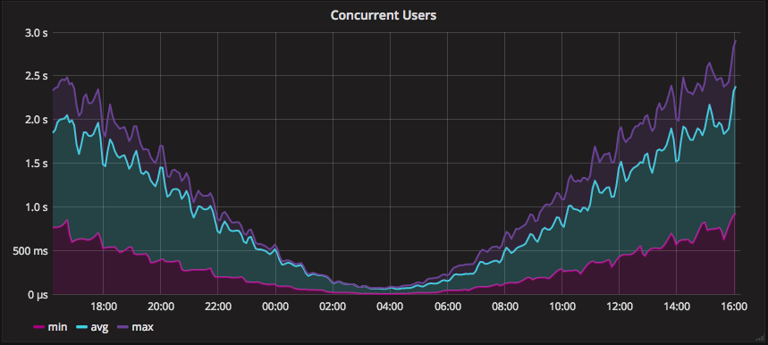

.. toctree::
   :maxdepth: 1
   :hidden:

   self
   sendingmetrics/index
   languageguide/index
   dashboards/index
   alerting/index
   agents/index
   integrationguide/index
   accountmanagement/index
   additional/index
   api/index
   faq

Welcome to Hosted Graphite (test)
==========================

.. contents::

.. index:: Graphite

Graphite
--------
`Graphite <https://graphite.readthedocs.io/en/latest/>`_ is an open-source and highly scalable, real-time graphing system. The metrics and data that you send to Graphite's **carbon endpoint** are timestamped, aggregated, stored, and can be graphed using a basic dashboard interface. Graphite is an efficient method of collecting and aggregating data, is well documented, and is easy to work with.

.. index:: Hosted Graphite

Hosted Graphite
---------------
Hosted Graphite has improved upon standard Graphite, and offers additional tools and features that provide our customers with a robust and well-rounded monitoring solution.

- Send :doc:`system metrics </agents/index>` from your running instances and servers, :doc:`custom metrics </languageguide/index>` from within your application code, or :doc:`service metrics </integrationguide/index>` from other popular services that we integrate with, like Heroku and AWS.

- Visualize your data in meaningful ways with customizable :doc:`dashboards </dashboards/grafana-dashboards>` that look awesome!

- Configure :doc:`alerts </alerting/index>` to your metrics and integrate with popular :ref:`notification channels <alerting_notification-channels>` such as Slack, and Pager Duty.

- We handle the aggregation, storage, and backups of your data. See the specific retention and resolution mappings :ref:`here <faq_technical>`.

- We offer fast and friendly `support <mailto:support@hostedgraphite.com>`_ and are dedicated to making sure you get the highest value possible from our services.

.. index:: Why you should use Hosted Graphite

Why You Should Use Hosted Graphite
---------------------------------- 
- Hosted Graphite takes away the burden of self-hosting your own monitoring solution, allowing you more time and freedom to work on your most important tasks. You can measure, analyze, and visualize large amounts of data from your applications and infrastructure without the hassles of setting up your own servers, worrying about scaling, storing data, alerting, or maintenance.
- You need a monitoring solution in order to make data driven decisions for your business. Get an instant overview of how your technology stack is performing by monitoring your systems and observing trends in your data.
- Hosted Graphite has many supported APIs, integrations, and plugins that can help you get data in, and return it in a way that is useful for you. Anytime you have questions about our product and services, our knowledgeable support team will respond quickly and give you useful advice.

A Simple Example
----------------

.. _a-simple-example:

A common monitoring target is the number of concurrent users in a web application. A possible solution is to have a scheduled background task, which once a minute queries the appropriate resource and sends us the current number of users. This metric is given an appropriate identifier, for example ``conc_users``. Each time we receive a message with a metric (or metrics), we store the values with a UNIX timestamp. When you create a new :doc:`dashboard <dashboards/grafana-dashboards>`, you can start graphing this newly available metric with just a few clicks:

   Example of a 'conc_users' metric graph

Simple but Powerful
-------------------

Although it lets you get up and running quickly with simple graphs, our :doc:`Hosted Dashboards<dashboards/grafana-dashboards>` are a very powerful tool. You can build complex graphs from multiple metrics, use `Graphite functions <https://graphite.readthedocs.io/en/latest/functions.html>`_ to manipulate the metric data, and have the ability to fine tune the styling of the graphs.

Here's another example: this time three metrics are being graphed simultaneously, and some styling has been applied to improve clarity. Check out the `graph panel reference <http://docs.grafana.org/features/panels/graph/>`_ to see some of the many available possibilities.

   Graphing three related metrics

.. index:: Metrics  

Metrics
-------
A metric is a unique time-series collection of name-value data which can be aggregated, graphed, and alerted on. In other words, a metric is a unique namespace that you can send data to or query data from.

.. _metric-data-format:

Metric Data Format
------------------
Hosted Graphite metrics should use the following format::

   metricname value [timestamp]

- **metricname** is a period-delimited path, such as ``servers.mario.memory.free``
  The periods will turn each path component into a sub-tree. The graphite project website has some `metric naming advice <https://graphite.readthedocs.io/en/latest/feeding-carbon.html#step-1-plan-a-naming-hierarchy>`_.
- **value** is an integer or floating point number. Hosted Graphite can only ingest numeric data.
- **timestamp** (optional) is a `UNIX timestamp <https://en.wikipedia.org/wiki/Unix_time>`_, which is the number of seconds since Jan 1st 1970 (always UTC, never local time). If no timestamp is provided, the current time will be assumed. This is probably "good enough" for most uses.

You can send multiple metric values at the same time by putting them on separate lines in the same message: ::

   test.app.conc_users 59
   test.memory.free_ram 33

Here's an example of a metric with the optional `UNIX timestamp <https://en.wikipedia.org/wiki/Unix_time>`_: ::

  test.app.conc_users 59 1340981282

This means that the metric will be stored as being measured at the time specified, instead of the arrival time at our server. This is good for sending us historical data, or when you need the timestamps to match exactly with the timestamps on your system logs. Understanding the metric data format is important because this is how our hosted carbon endpoint is able to accept data. 

Here's an example of how to send a metric via TCP using the `Netcat <http://netcat.sourceforge.net/>`_ utility: ::

  echo "YOUR-API-KEY.test.app.conc_users 59" | nc carbon.hostedgraphite.com 2003
  
In most cases, including this case, the ``test.app.conc_users`` metric will be timestamped upon ingestion.

.. _api-key:

API Key
-------
Every Hosted Graphite account has an associated **API Key**. This API Key must be sent along with your metric data to associate it with your account. In most cases this means prefixing the key to your your metric names, e.g. ``YOUR-API-KEY.metricname`` which will ensure that **your data is securely sent** to our hosted `carbon` endpoint.

.. index:: Sending Metrics

Sending Metrics to Hosted Graphite
----------------------------------

There are many ways to send metrics to us that are detailed in our :doc:`Sending Metrics Guide <sendingmetrics/index>`. The most basic ways include TCP, UDP, and HTTP as seen in our :doc:`Supported Protocols Guide </sendingmetrics/supported-protocols>`. Or you can let a service/daemon perform the work, such as one of our supported :doc:`agents </agents/index>`.

We also have plugins for popular PAAS services such as :doc:`Heroku <integrationguide/ig_heroku>` and :doc:`AWS Cloudwatch <integrationguide/ig_aws_cloudwatch>`. See our :doc:`Add-Ons and Integrations Guide <integrationguide/index>` for a full list of platforms and plugins that we support.

.. raw:: html

    

