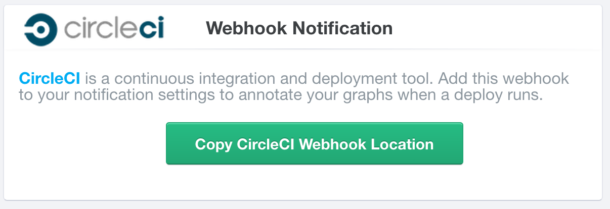
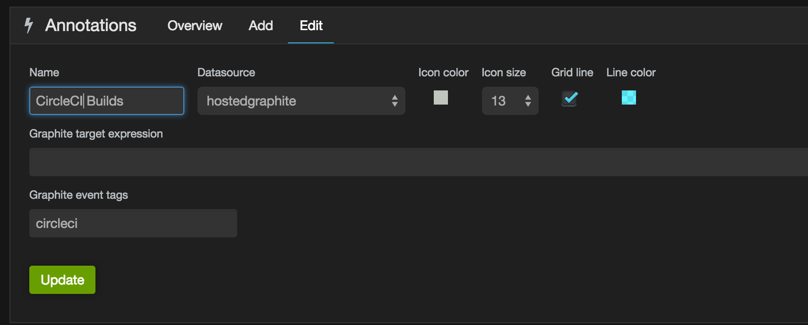

Circle CI
=========
CircleCI is a continuous integration tool that allows you to rapidly run tests on every change to your code. When one of your team changes something in your codebase, CircleCI runs your test suite and notifies you of any problems. If they all pass, you're good to deploy!

One useful way of monitoring the changes in your codebase is by adding annotations whenever your tests run. Now, with this handy Hosted Graphite webhook you can do just that.

How to set up a CircleCI webhook
--------------------------------

CircleCI's documentation lists `how to edit your CircleCI configuration to add a new webhook url <https://circleci.com/docs/configuration#notify/>`_.

To get your webhook URL from Hosted Graphite - Simply click the "Copy CircleCI webhook URL" button on the `add-ons <https://www.hostedgraphite.com/app/addons/>`_ page, and add the URL to your circle configuration.

To see the annotations on your graph, enable them in your dashboard settings and they will appear on your graph:

