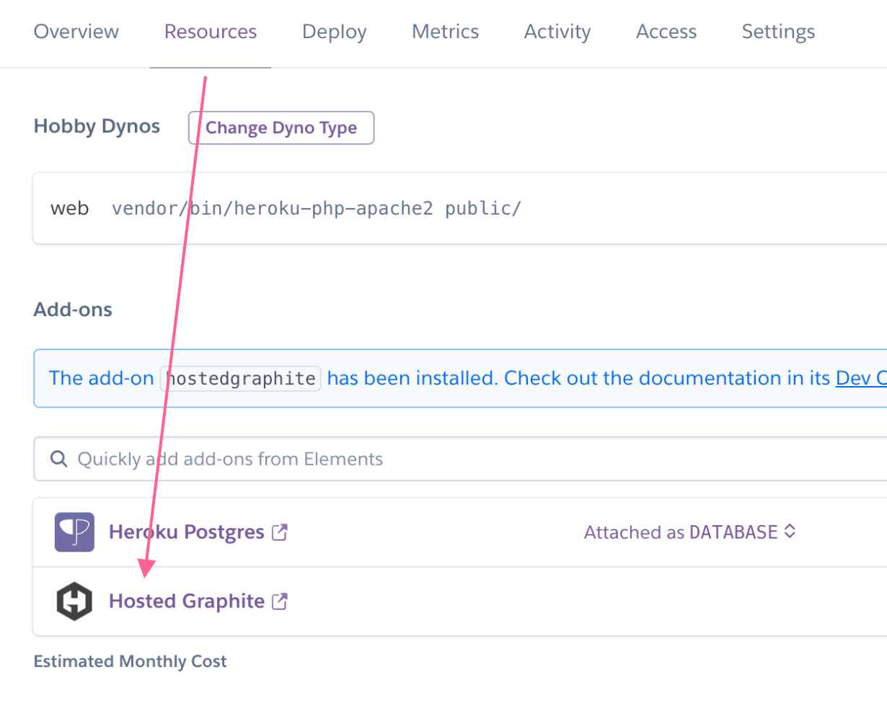
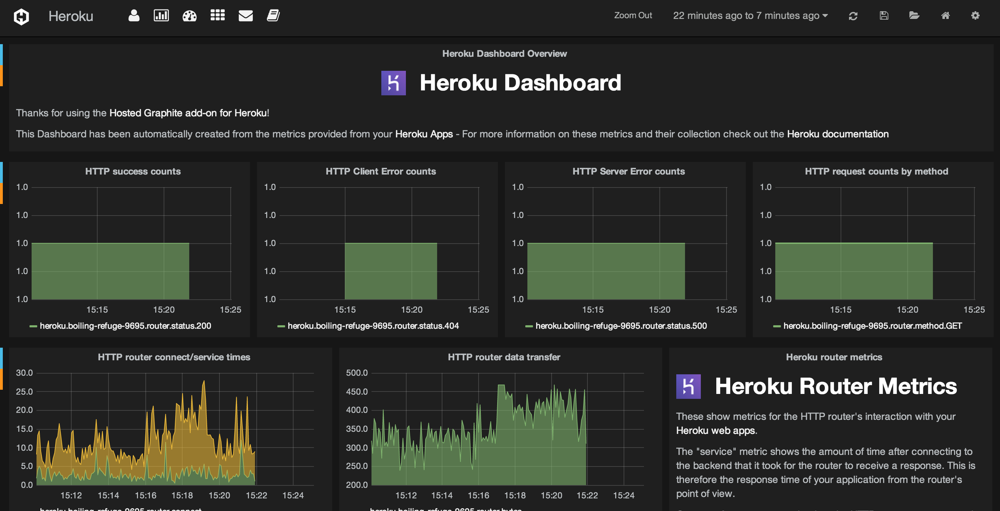

Heroku
======

.. index:: heroku

.. contents::

Installing the Hosted Graphite Heroku Add-On
++++++++++++++++++++++++++++++++++++++++++++

Hosted Graphite has a `Heroku Add-On <https://elements.heroku.com/addons/hostedgraphite>`_! Installing the add-on can be done through your Heroku account in the 'Resources' section, or by issuing the following command in your Heroku CLI:

  .. code-block:: none

    heroku addons:add hostedgraphite -a <app-name>
	
Make sure to replace the variable **<app-name>** with the name of your application, as it appears in your Heroku account. Once the add-on is installed, a new application configuration key will be created, called ``HOSTEDGRAPHITE_APIKEY``. Confirm the key by issuing this command:

  .. code-block:: none

    heroku config:get HOSTEDGRAPHITE_APIKEY -a <app-name>
    
Now, you just need to run one more command from the Heroku CLI to send the application's dyno metrics to your new HG account:

  .. code-block:: none

    heroku drains:add https://webhooks.hostedgraphite.com/heroku/<app-name>/logs/\?apikey=<api-key> -a <app-name>

**Note:** Including the app-name in the Log-Drain command prevents individual dyno metric duplication and stores them in the following format: 

``heroku.<appname>.<dyno>.<dyno_number>.<rest_of_metric>``

You can now navigate to your new Hosted Graphite account through the Heroku UI and wait for the metrics to appear.

For full documentation on our Heroku Add-On, please visit the `Hosted Graphite on Heroku <https://devcenter.heroku.com/articles/hostedgraphite>`_ page.

Heroku Auto-Dashboard
----------------------
This dashboard will be automatically created when you enable the Heroku Add-On, or configure Log-Drain metrics to your :ref:`existing Hosted Graphite account <existing-hg-account>`:

  Automatic Heroku Dashboard

Using Heroku's `Log-Runtime metrics <https://devcenter.heroku.com/articles/log-runtime-metrics>`_ we retrieve and process Heroku's syslog information for your Dynos including:

- **Load average** - 1 / 5 / 15 minute averages
- **Memory and Swap** - Resident memory, disk cache, swap, total memory, and cumulative totals for pages written to and read from disk.
- **HTTP metrics** - The number of requests broken down by HTTP method and status codes, data transferred, and connect and service times.

Local Development Configuration
-------------------------------
In your local development environment, it will be necessary to replicate the above configuration. Since the `Foreman tool <https://devcenter.heroku.com/articles/procfile#developing-locally-with-foreman>`_ will look in the ``.env`` file for development environment variables, use the following command to copy the ``HOSTEDGRAPHITE_APIKEY`` from the heroku config (Do not check the file ``.env`` into source control).

  .. code-block:: none
  
	  heroku config -s | grep HOSTEDGRAPHITE_APIKEY >> .env -a <app-name>
    
  .. code-block:: none
  
	  more .env

More information on accessing your your API key is detailed in the below section.

Accessing the API Key Within Your App
-------------------------------------

Now that the add-on has been setup, the Hosted Graphite :ref:`API Key <api-key>` will be available via the environment variable **HOSTEDGRAPHITE_APIKEY**. See the appropriate language snippet below for an example on how to access this variable in your app.

**Ruby** See also: :doc:`Sending Metrics with Ruby </languageguide/lg_ruby>`

.. code-block:: ruby
    
	apikey = ENV['HOSTEDGRAPHITE_APIKEY']	

**Python** See also: :doc:`Sending Metrics with Python </languageguide/lg_python>`
	
.. code-block:: python
    
	apikey = os.environ['HOSTEDGRAPHITE_APIKEY']
 
	
**Java** See also: :doc:`Sending Metrics with Java </languageguide/lg_java>`
	
.. code-block:: java

    String apikey = System.getenv("HOSTEDGRAPHITE_APIKEY");

**PHP** See also: :doc:`Sending Metrics with PHP </languageguide/lg_php>`
	
.. code-block:: php

	$apikey = getenv('HOSTEDGRAPHITE_APIKEY');
	

**Node.js** See also: :doc:`Sending Metrics with Node.js </languageguide/lg_nodejs>`
		
.. code-block:: javascript

    var apikey = process.env.HOSTEDGRAPHITE_APIKEY;

Custom Metrics
--------------
You can send :ref:`metric messages <metric-data-format>` to Hosted Graphite from your Heroku app. See our :doc:`Language Guide </languageguide/index>` for more information on sending custom metrics through your application code using a socket connection. 

.. _existing-hg-account:

Monitoring Heroku Metrics on and Existing HG Account
++++++++++++++++++++++++++++++++++++++++++++++++++++

.. index: Monitor Heroku from an existing HG account

If you already have a Hosted Graphite account and you want to send dyno metrics from your Heroku application, you must first enable the `Log-Runtime metrics <https://devcenter.heroku.com/articles/log-runtime-metrics>`_ by running the following command in your Heroku CLI:

  .. code-block:: none
  
      heroku labs:enable log-runtime-metrics -a <app-name>

After enabling runtime metrics, you will need to restart your Heroku application:

  .. code-block:: none

      heroku restart -a <app-name>
    
After that you can just point the Heroku app logs to your existing Hosted Graphite account by running the following command:

  .. code-block:: none

      heroku drains:add https://webhooks.hostedgraphite.com/heroku/<app-name>/logs/\?apikey=<api-key> -a <app-name>
      
**NOTE:** Make sure to replace the variables **<app-name>** and **<api-key>** with their respective details and once the metrics are sent, a Heroku dashboard will be automatically created in your account. You are able to gather metrics from as many Heroku apps as you like, but it can take up to several hours for all of the application metrics to appear for the first time.

