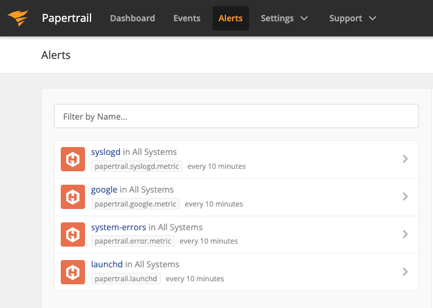

Papertrail
==========

`Papertrail <https://papertrailapp.com/>`_, now owned by Solarwinds, is a log management service which allows you to manage logs from apps, servers, and cloud services with the use of alerts and events. This can be useful for monitoring the number of specified occurrences in your logs. You also have the ability to create custom dashboards and alerts for the metrics that are created through our Papertrail integration. 

All you need to get started is an account in Papertrail and an account on Hosted Graphite. Check out the `Papertrail documentation <https://help.papertrailapp.com/kb/integrations/hostedgraphite/>`_ for more details on how to create alerts in Papertrail that will create and forward metrics to us.

   
   A simple example of configuring alerts in Papertrail