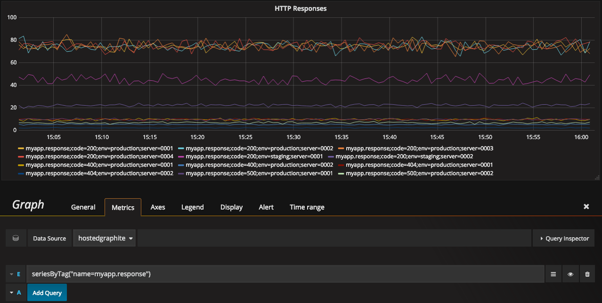
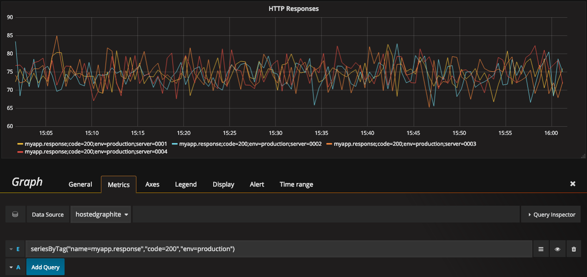
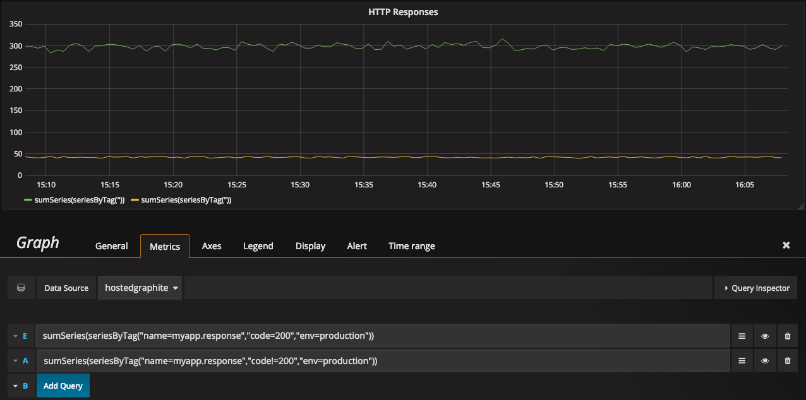
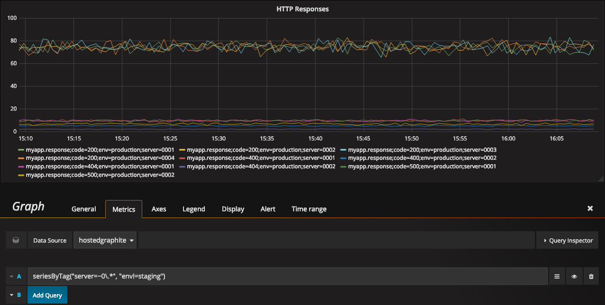
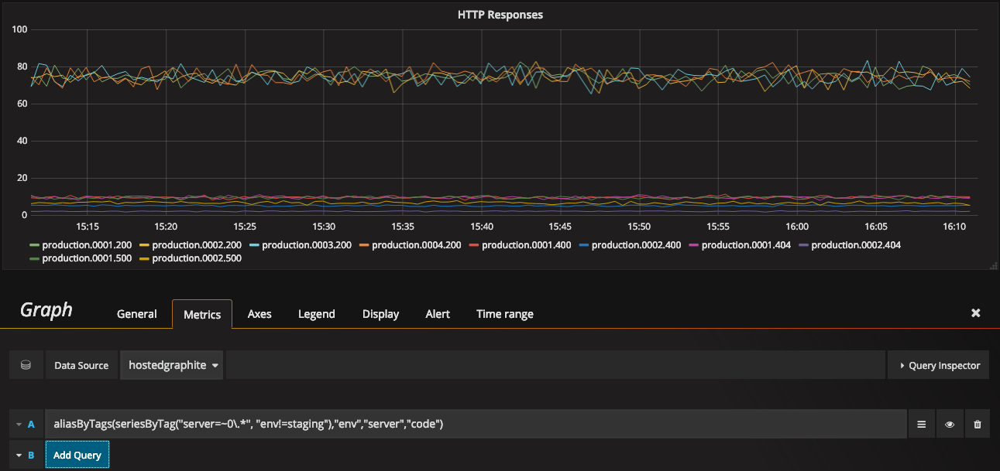
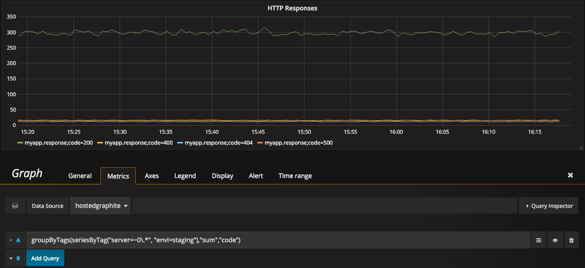
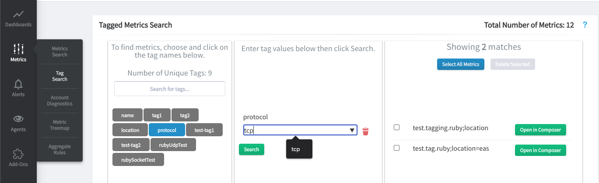

Graphite Tag Support
====================

.. contents::

What are Graphite Tags?
-----------------------
With the release of the 1.1.x series, Graphite now supports `tagged metrics <https://graphite.readthedocs.io/en/latest/tags.html>`_.

Rather than using the traditional dotted hierarchy, metrics can be stored and retrieved based on tags - for example, ``host=webserver-`` or ``region=us-east-1``.

So where before you might have a name like **myapp.webserver-0001.us-east-1.responses.500**, you could instead have **myapp.responses;host=webserver-0001;region=us-east-1;code=500**

Why use Graphite Tags?
----------------------

It’s becoming common in monitoring systems to use a tagged (or labeled) metric format. This allows for more flexibility both in naming and retrieving metrics.

**Note** that when using tags, each metric is uniquely identified by its **name** and set of **tag/value pairs**. As a result, an existing tagged metric cannot be updated to contain new tags.

For example, let's count 500 responses for `My App` in both formats:

**Dotted Format**

::

 myapp.*.*.responses.500

* Order matters
* Can have many node options which can be unwieldly

**Tag Format**

::

 seriesByTag("path=myapp.responses","code=500")

* Order does not matter
* You do not always need every node in the metric name to locate one metric or series
* Does not support wildcards, but accepts regular expressions

The latter allows us to quickly slice and dice metrics by their tags that you get to specify when creating the metric. We don’t have to remember what’s in each position in the dotted hierarchy, and the tags make the query “self documenting”.

Tags are particularly useful in modern cloud environments, where e.g. host or instance may change often, while the total number of metrics being stored and queried remains fairly constant.

Sending Tagged Metrics
----------------------

You can use the same Carbon endpoints you already use to send tagged metrics. All you need to do is include the tags and values in the updated Carbon line protocol format (unix timestamp is optional):
::

  my.series;tag1=value1;tag2=value2 metric_value (timestamp)

E.g. to get started quickly you can use the `netcat <http://netcat.sourceforge.net/>`_ utility as follows:

.. code-block:: bash

    echo "YOUR-API-KEY.foo.bar;tag1=value1;tag2=value2 1.2" | nc carbon.hostedgraphite.com 2003

Sending metrics in your favorite language is similar. Refer to :doc:`our language guide </languageguide/index>`.

Graphing Tagged Metrics
-----------------------

You can search for metrics by their tag values, or by the metric name. **All queries should be wrapped with a seriesByTag() graphite function.** You can do this in your dashboards by toggling the query box to `free-text-mode` and typing out the full query. Or you could begin by adding the seriesByTag() function and filling the boxes with your search terms using the expressions (see table below) where necessary.

.. index:: seriesbytag

seriesByTag()
+++++++++++++

You can use any number of tag expressions to filter through your metrics:

::

  seriesByTag("name=myapp.response")
  seriesByTag("name=myapp.response","code=200")
  seriesByTag("name=myapp.response","code=200","env=production")

Other graphite functions also work, such as `sumSeries` in the below example:

::

  sumSeries(seriesByTag("name=myapp.response","code=200","env=production"))
  sumSeries(seriesByTag("name=myapp.response","code!=200","env=production"))

**For a full list of Graphite functions and how to use them, check out the `Graphite Docs <https://graphite.readthedocs.io/en/latest/functions.html>`_.**

seriesByTag() supports any number of tag expressions to refine the results. If using multiple expressions, only series that match all of them will be returned. Expressions have the following formats:

+------------+---------------------------------------------------------+
|tag=spec    |tag value exactly matches the spec                       |
+------------+---------------------------------------------------------+
|tag!=spec   |tag value does not exactly match the spec                |
+------------+---------------------------------------------------------+
|tag=~spec   |tag value matches the regular expression spec            |
+------------+---------------------------------------------------------+
|tag!=~spec  |tag value does not match the regular expression spec     |
+------------+---------------------------------------------------------+

**Example:**

Find all series where server matches the regular expression ``0\.*`` and env is not staging

::

  seriesByTag("server=~0\.*","env!=staging")

.. index:: aliasbytags, groupbytags

aliasByTags() and groupByTags()
+++++++++++++++++++++++++++++++

These are the 'tagged' equivalent of the aliasByNodes() and groupByNodes() Graphite functions.

**aliasByTags** requires at least one tag name to be passed in, below we have three:

::

  aliasByTags(seriesByTag("server=~0\.*","env!=staging"),"env","server","code")

**groupByTags** requires an aggregation method to be passed in (e.g. min, max, avg, sum, etc.), below we use sum:

::

  groupByTags(seriesByTag("server=~0\.*", "env!=staging"),"sum","code")

For more information about querying tagged metrics refer to the `Graphite Tag Docs <https://graphite.readthedocs.io/en/latest/tags.html#querying>`_

Managing Tagged Metrics
-----------------------

You can easily locate and delete your tagged metrics from within our Tag Search feature. Just select a tag name, search for a value, and a list of matching metrics will be rendered with the option to view or delete any selected metrics.

Tag API
-------

Check out our tag API documentation :doc:`here </api/tag_api>`.

.. raw:: html

    
